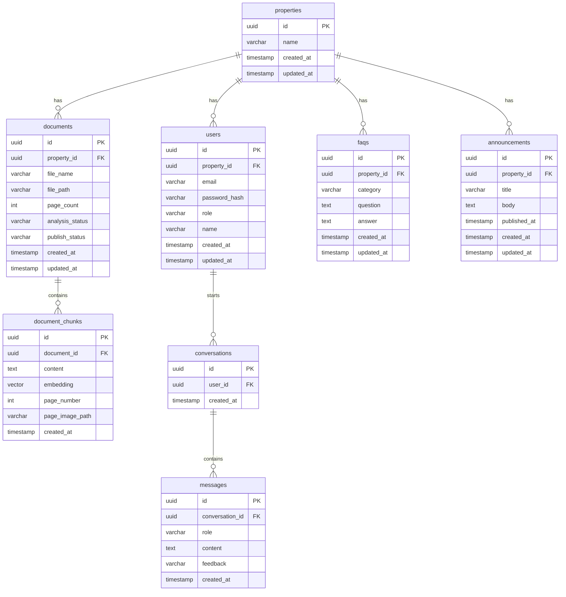

# DB設計書

> IPO と Data 一覧から、効果的なDB設計を作成

## テーブル一覧

| テーブル名 | 目的 | 関連データ項目 |
|-----------|------|--------------|
| properties | 物件情報の管理 | 物件ID、物件名 |
| users | ユーザー（入居者・管理者）の管理 | ユーザーID、メールアドレス、パスワード、ロール、ユーザー名、所属物件ID |
| documents | アップロードされたPDFドキュメントの管理 | ドキュメントID、ファイル名、ファイルパス、ページ数、解析ステータス、公開ステータス |
| document_chunks | PDFから抽出したテキストチャンクとベクトルデータ | チャンクID、チャンクテキスト、ベクトルデータ、ページ番号、ページ画像パス |
| faqs | FAQ（質問と回答）の管理 | FAQ ID、質問テキスト、回答テキスト、カテゴリ |
| conversations | チャットセッションの管理 | 会話ID |
| messages | チャットの各メッセージ（質問・回答）の記録 | メッセージ内容、メッセージ種別、フィードバック、送信日時 |
| announcements | お知らせ情報の管理 | お知らせID、タイトル、本文、掲載日時 |

## ER図

## テーブル詳細

### properties

**目的**: 三菱地所が管理する物件（ビル）の情報を管理する

| カラム | 型 | 制約 | 説明 |
|-------|-----|------|------|
| id | uuid | PK, DEFAULT gen_random_uuid() | 主キー |
| name | varchar(255) | NOT NULL | 物件名（例：大手町パークビルディング） |
| created_at | timestamp | DEFAULT CURRENT_TIMESTAMP | 作成日時 |
| updated_at | timestamp | DEFAULT CURRENT_TIMESTAMP | 更新日時 |

### users

**目的**: 入居者（総務担当者・一般社員）と管理者（物件管理者）の認証・管理

| カラム | 型 | 制約 | 説明 |
|-------|-----|------|------|
| id | uuid | PK, DEFAULT gen_random_uuid() | 主キー |
| property_id | uuid | FK(properties.id), NOT NULL | 所属物件 |
| email | varchar(255) | NOT NULL, UNIQUE | ログイン用メールアドレス |
| password_hash | varchar(255) | NOT NULL | ハッシュ化されたパスワード |
| role | varchar(20) | NOT NULL, CHECK(role IN ('tenant', 'admin')) | ユーザー種別（tenant=入居者, admin=管理者） |
| name | varchar(255) | NOT NULL | 表示用ユーザー名 |
| created_at | timestamp | DEFAULT CURRENT_TIMESTAMP | 作成日時 |
| updated_at | timestamp | DEFAULT CURRENT_TIMESTAMP | 更新日時 |

### documents

**目的**: 管理者がアップロードしたテナントマニュアルPDFの管理

| カラム | 型 | 制約 | 説明 |
|-------|-----|------|------|
| id | uuid | PK, DEFAULT gen_random_uuid() | 主キー |
| property_id | uuid | FK(properties.id), NOT NULL | 所属物件 |
| file_name | varchar(255) | NOT NULL | アップロードされたPDFのファイル名 |
| file_path | varchar(1024) | NOT NULL | Supabase StorageのパスまたはURL |
| page_count | integer | NOT NULL, DEFAULT 0 | PDFの総ページ数 |
| analysis_status | varchar(20) | NOT NULL, DEFAULT 'pending', CHECK(analysis_status IN ('pending', 'processing', 'completed', 'error')) | 解析処理の状態 |
| publish_status | varchar(20) | NOT NULL, DEFAULT 'unpublished', CHECK(publish_status IN ('unpublished', 'published')) | 公開状態 |
| created_at | timestamp | DEFAULT CURRENT_TIMESTAMP | 作成日時 |
| updated_at | timestamp | DEFAULT CURRENT_TIMESTAMP | 更新日時 |

### document_chunks

**目的**: PDFから抽出されたテキストチャンクとベクトルデータを格納し、類似度検索に使用

| カラム | 型 | 制約 | 説明 |
|-------|-----|------|------|
| id | uuid | PK, DEFAULT gen_random_uuid() | 主キー |
| document_id | uuid | FK(documents.id) ON DELETE CASCADE, NOT NULL | 元のドキュメント |
| content | text | NOT NULL | PDFから抽出されたテキスト断片 |
| embedding | vector(1536) | NOT NULL | テキストの埋め込みベクトル（OpenAI text-embedding-3-small） |
| page_number | integer | NOT NULL | チャンクが属するPDFのページ番号 |
| page_image_path | varchar(1024) | | マニュアルページのサムネイル画像パス |
| created_at | timestamp | DEFAULT CURRENT_TIMESTAMP | 作成日時 |

### faqs

**目的**: 管理者が登録するFAQ（よくある質問と回答）の管理

| カラム | 型 | 制約 | 説明 |
|-------|-----|------|------|
| id | uuid | PK, DEFAULT gen_random_uuid() | 主キー |
| property_id | uuid | FK(properties.id), NOT NULL | 所属物件 |
| category | varchar(100) | NOT NULL | カテゴリ（ゴミ出し、空調、駐車場、入退館、防災、申請手続き等） |
| question | text | NOT NULL | FAQの質問文 |
| answer | text | NOT NULL | FAQの回答文 |
| created_at | timestamp | DEFAULT CURRENT_TIMESTAMP | 作成日時 |
| updated_at | timestamp | DEFAULT CURRENT_TIMESTAMP | 更新日時 |

### conversations

**目的**: チャットセッション（会話単位）の管理

| カラム | 型 | 制約 | 説明 |
|-------|-----|------|------|
| id | uuid | PK, DEFAULT gen_random_uuid() | 主キー |
| user_id | uuid | FK(users.id), NOT NULL | 会話を開始したユーザー |
| created_at | timestamp | DEFAULT CURRENT_TIMESTAMP | 作成日時 |

### messages

**目的**: チャットの各メッセージ（ユーザーの質問・AIの回答）の記録

| カラム | 型 | 制約 | 説明 |
|-------|-----|------|------|
| id | uuid | PK, DEFAULT gen_random_uuid() | 主キー |
| conversation_id | uuid | FK(conversations.id) ON DELETE CASCADE, NOT NULL | 所属する会話 |
| role | varchar(20) | NOT NULL, CHECK(role IN ('user', 'assistant')) | 発信者種別（user=ユーザー, assistant=AI） |
| content | text | NOT NULL | メッセージ内容 |
| feedback | varchar(20) | CHECK(feedback IN ('positive', 'negative')), DEFAULT NULL | 回答への評価（AI回答のみ。NULL=未評価） |
| created_at | timestamp | DEFAULT CURRENT_TIMESTAMP | 送信日時 |

### announcements

**目的**: 管理者から入居者へのお知らせ情報の管理

| カラム | 型 | 制約 | 説明 |
|-------|-----|------|------|
| id | uuid | PK, DEFAULT gen_random_uuid() | 主キー |
| property_id | uuid | FK(properties.id), NOT NULL | 所属物件 |
| title | varchar(255) | NOT NULL | お知らせのタイトル |
| body | text | NOT NULL | お知らせの本文 |
| published_at | timestamp | NOT NULL | 掲載日時（表示順の基準） |
| created_at | timestamp | DEFAULT CURRENT_TIMESTAMP | 作成日時 |
| updated_at | timestamp | DEFAULT CURRENT_TIMESTAMP | 更新日時 |

---

## 次のステップ

→ `/design-requirements-v2` で要件定義書を更新する
