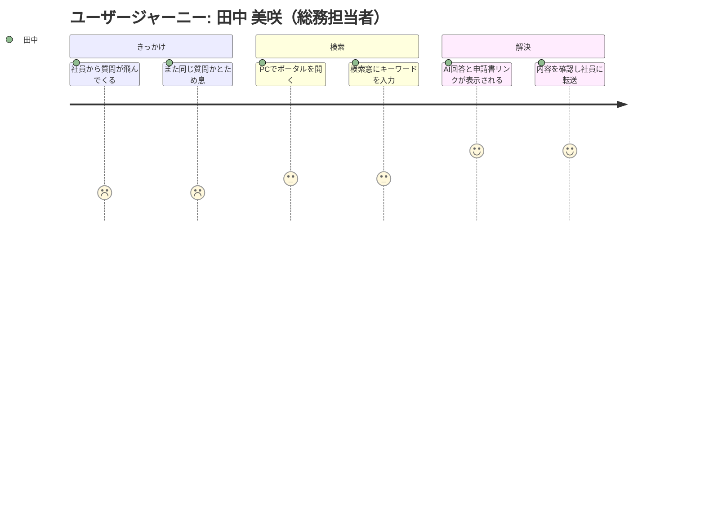
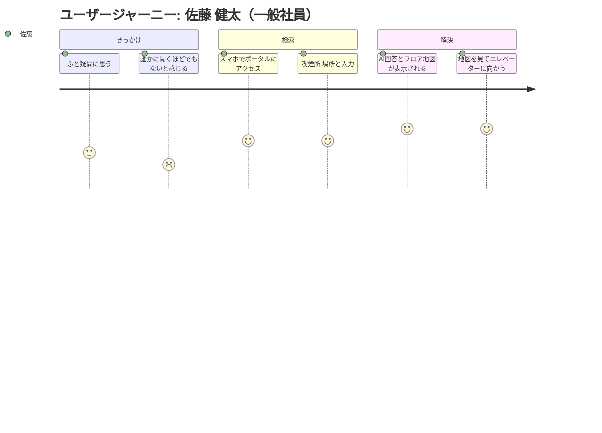
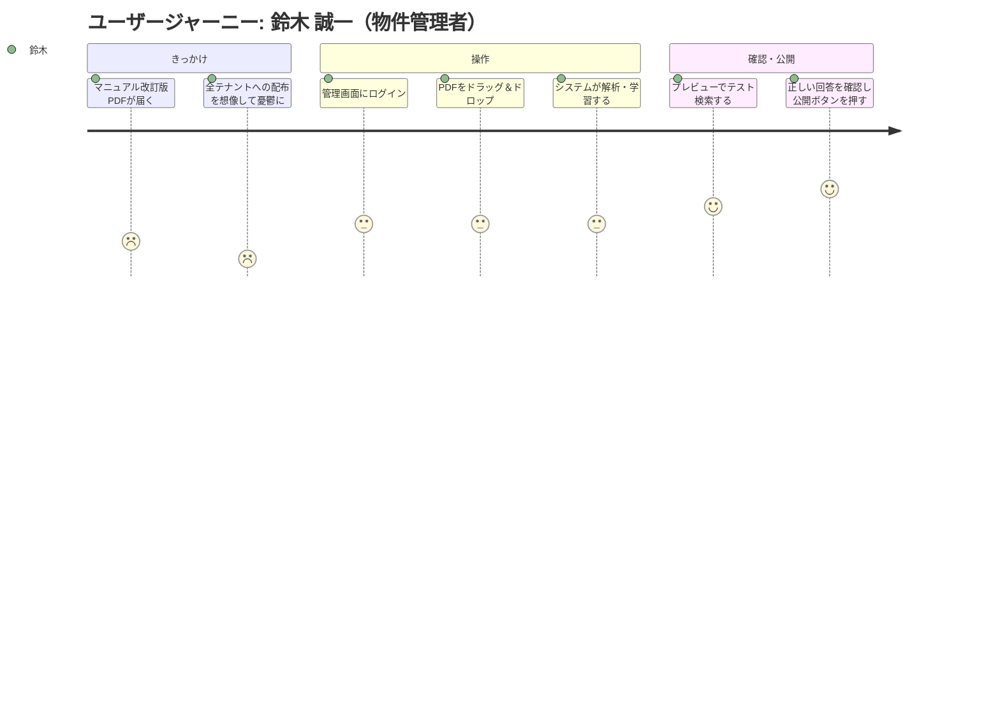

# ユーザージャーニー

## ペルソナ 1: 田中 美咲（総務担当者）

| 項目 | 内容 |
|-----|------|
| ペルソナ | 田中 美咲（総務担当者） |
| ユーザー像 | 30代、総務部主任。社員からのビル設備に関する問い合わせ窓口 |
| 課題 | マニュアルPDFから情報を探すのに毎回10〜15分かかる。同じ質問を繰り返し受ける |
| 利用シーン | 社員からチャットで「休日入館の申請ってどうやるの？」と質問が飛んできた時 |

### ジャーニーマップ

### メインフロー

| # | フェーズ | 行動 | 課題・感情 | 解決 |
|---|---------|------|----------|------|
| 1 | きっかけ | 社員から「休日入館の申請ってどうやる？」とチャットで質問される | 「また同じ質問…マニュアルのどこだっけ…」（面倒） | ポータルの存在を思い出す |
| 2 | 検索 | PCでポータルを開き「休日入館　申請」と入力 | 「キーワードだけで出るかな…」（不安） | AIが自然言語を理解し的確な結果を返す |
| 3 | 解決 | AI回答を確認し、申請書PDFリンクとともに社員へ返信 | 「書類の場所まで一発で出た！」（安堵・達成感） | 探す手間が省け、数分で対応完了 |

### 感情の変化

- **開始時**: 「また同じ質問…マニュアルのどこだっけ…」（面倒）
- **最初のつまずき**: 「キーワードだけで出るかな…」（不安）
- **ブレークスルー**: AI回答に加え申請書PDFのダウンロードリンクまで表示された
- **ゴール達成時**: 「探す手間が省けて助かった！」（安堵・達成感）

---

## ペルソナ 2: 佐藤 健太（一般社員）

| 項目 | 内容 |
|-----|------|
| ペルソナ | 佐藤 健太（一般社員） |
| ユーザー像 | 20代、営業部担当。スマホネイティブ世代 |
| 課題 | ちょっとした疑問を総務に聞くのは気が引ける。マニュアルPDFは長すぎて開く気にならない |
| 利用シーン | 休憩中に「喫煙所って何階にあるんだっけ？」とふと思った時 |

### ジャーニーマップ

### メインフロー

| # | フェーズ | 行動 | 課題・感情 | 解決 |
|---|---------|------|----------|------|
| 1 | きっかけ | 「喫煙所って何階？」とふと思うが、総務に聞くのは気が引ける | 「わざわざ誰かに聞くほどでもないけど…」（遠慮） | 自分で調べられる手段がある |
| 2 | 検索 | スマホでポータルにアクセスし「喫煙所　場所」と入力 | 特になし（スマホ操作に慣れている） | 即座に検索結果が返る |
| 3 | 解決 | AI回答で場所と利用時間が表示され、フロア地図も引用される | 「スマホですぐわかった」（満足） | 地図付きで迷わず到着 |

### 感情の変化

- **開始時**: 「わざわざ誰かに聞くほどでもないけど知りたい」（遠慮）
- **最初のつまずき**: なし（スマホ操作はスムーズ）
- **ブレークスルー**: テキスト回答だけでなく、フロア地図の画像まで引用表示された
- **ゴール達成時**: 「お、スマホですぐわかった。便利。」（満足）

---

## ペルソナ 3: 鈴木 誠一（物件管理者）

| 項目 | 内容 |
|-----|------|
| ペルソナ | 鈴木 誠一（物件管理者） |
| ユーザー像 | 50代、管理事務所所長。新しいツールの導入には慎重 |
| 課題 | マニュアル改訂時の全テナントへの周知が大変。定型的な問い合わせ対応に追われている |
| 利用シーン | ゴミ出しルールが変更になり、改訂版PDFが手元に届いた時 |

### ジャーニーマップ

### メインフロー

| # | フェーズ | 行動 | 課題・感情 | 解決 |
|---|---------|------|----------|------|
| 1 | きっかけ | ゴミ出しルール変更に伴い改訂版PDFが届く | 「全テナントに配布して差し替えてもらうのは大変…」（憂鬱） | ポータルに登録すれば自動反映される |
| 2 | 操作 | 管理画面でPDFをドラッグ＆ドロップし、システムの解析完了を待つ | 「PDF入れるだけで本当にAIが覚えるのか？」（懐疑的） | 数秒〜数分で解析完了 |
| 3 | 確認・公開 | 「ゴミ出し　変更」でテスト検索し、正しい回答を確認後「公開」を押す | 「これで問い合わせが来ても『ポータル見て』と言える」（期待・安心） | テスト確認で安心して公開できる |

### 感情の変化

- **開始時**: 「全テナントに配布して差し替えてもらうのは大変だ…」（憂鬱）
- **最初のつまずき**: 「PDF入れるだけで本当にAIが覚えるのか？」（懐疑的）
- **ブレークスルー**: テスト検索で正しい回答が返ってきた瞬間
- **ゴール達成時**: 「これで問い合わせが来ても『ポータル見て』と言える」（期待・安心）

---

## 次のステップ

→ `/design-spec` で仕様書を作成する
