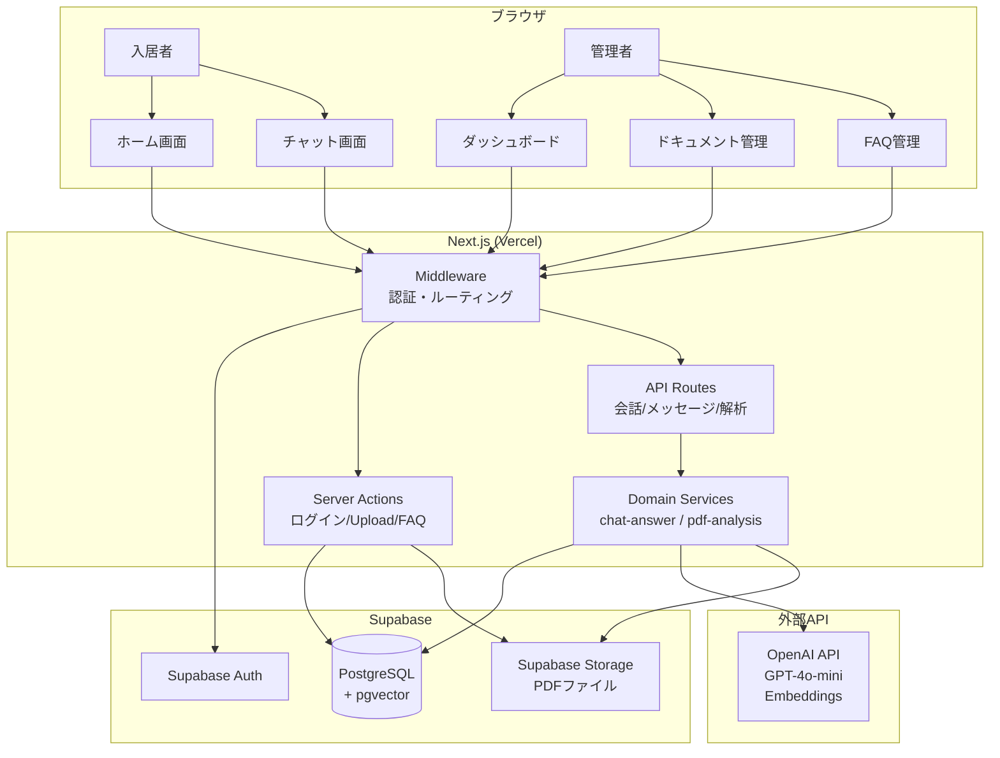
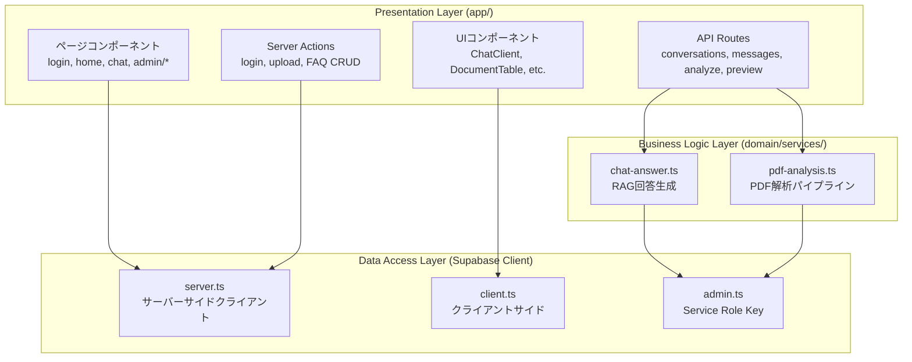
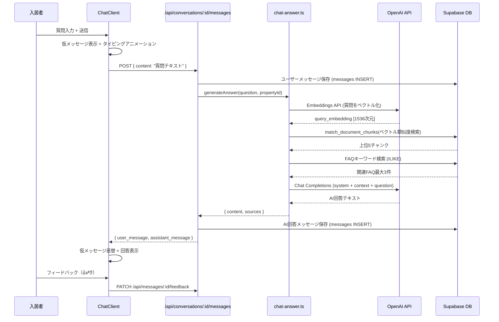
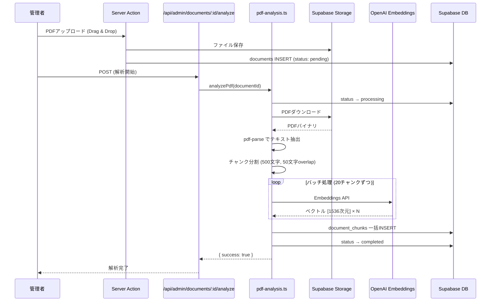
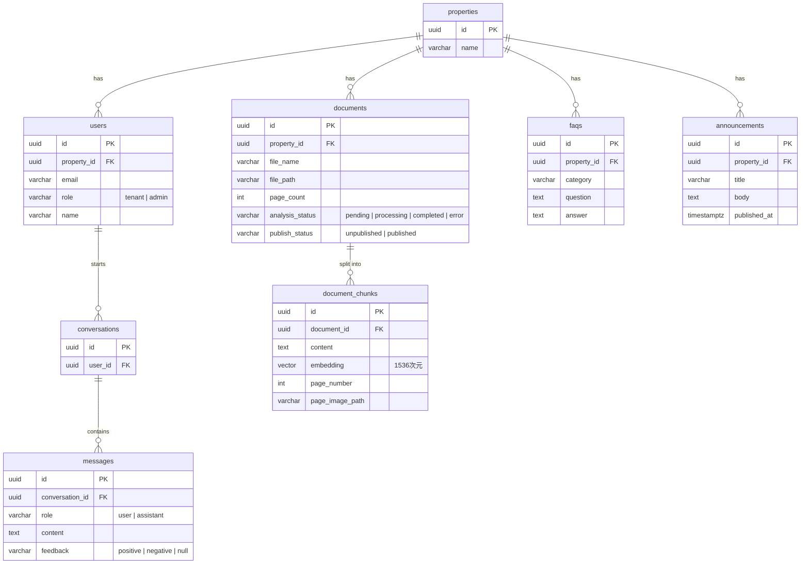

# Step 2: 俯瞰図解

## システム構成図



## 3レイヤードアーキテクチャ



## AI チャット（RAG）フロー



## PDF解析パイプライン



## 認証・ルーティングフロー

```mermaid
flowchart TD
    REQ[リクエスト] --> MW{Middleware}

    MW --> CHK1{認証済み?}
    CHK1 -->|No| PATH1{/login ?}
    PATH1 -->|Yes| LOGIN[ログイン画面表示]
    PATH1 -->|No| REDIR1[/login へリダイレクト]

    CHK1 -->|Yes| PATH2{/login ?}
    PATH2 -->|Yes| ROLE1{ロール判定}
    ROLE1 -->|admin| REDIR2[/admin へリダイレクト]
    ROLE1 -->|tenant| REDIR3[/home へリダイレクト]

    PATH2 -->|No| PATH3{/admin/* ?}
    PATH3 -->|Yes| ROLE2{admin ロール?}
    ROLE2 -->|Yes| ALLOW[アクセス許可]
    ROLE2 -->|No| REDIR4[/home へリダイレクト]

    PATH3 -->|No| ALLOW
```

## データベースER図


