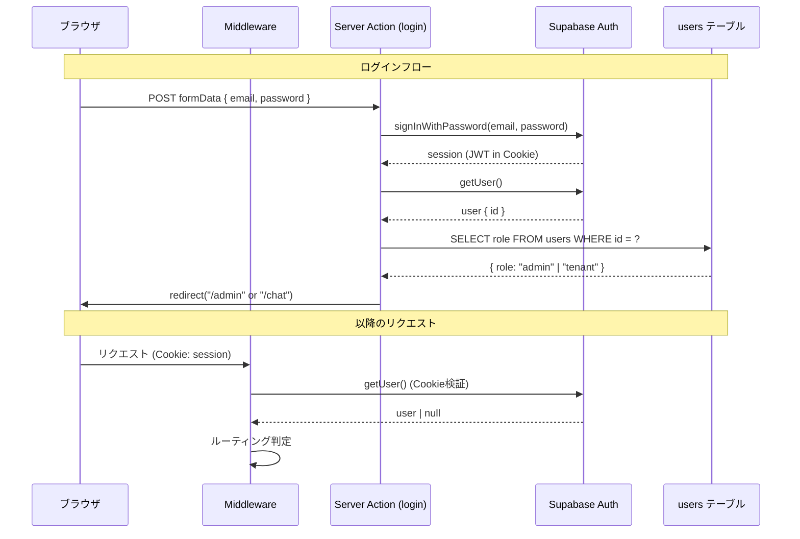
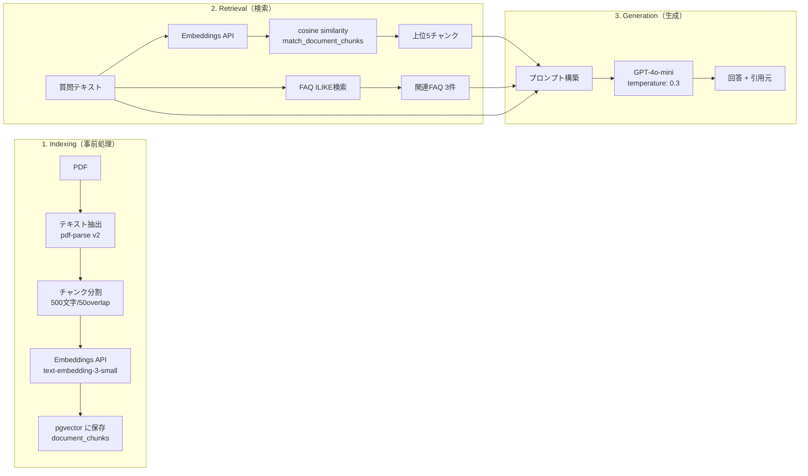
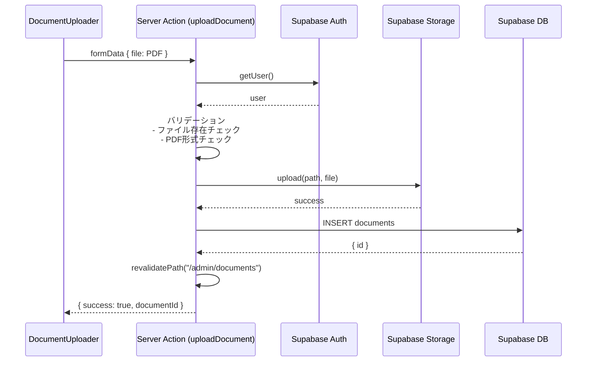
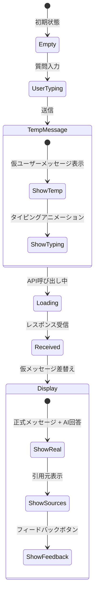

# Step 4: 詳細図解

## セグメント 1: 認証・ルーティング

### 認証方式の仕組み



### Middleware の判定ロジック

```
リクエスト受信
│
├── 未認証 & パスが /login 以外 → /login にリダイレクト
├── 認証済み & パスが /login → ロール判定 → /admin or /home
├── 認証済み & パスが /admin/* → admin ロール確認
│   ├── admin → 許可
│   └── tenant → /home にリダイレクト
└── その他 → 許可
```

### Cookie ベース SSR 認証のポイント
- `@supabase/ssr` の `createServerClient` を使用
- Cookie の読み書きを Next.js Request/Response に委譲
- Middleware でセッション更新（`setAll` で Cookie リフレッシュ）
- 静的アセットは matcher で除外

---

## セグメント 2: AI コア（RAG パイプライン）

### RAG（Retrieval-Augmented Generation）アーキテクチャ



### チャンク分割アルゴリズム

```
入力: "ABCDEFGHIJKLMNOPQRSTUVWXYZ..." (長いテキスト)
設定: chunkSize=500, overlap=50

チャンク1: [0, 500)    → "ABCDE...XYZ..."
チャンク2: [450, 950)  → "...VWX...ABC..."  ← 50文字重複
チャンク3: [900, 1400) → "...YZA...DEF..."
...

目的: 文の途中で切れても、前後のチャンクに重複部分があるため
      文脈が失われにくい
```

### ベクトル検索（pgvector）

```sql
-- match_document_chunks 関数（概要）
SELECT
    dc.id,
    dc.content,
    dc.page_number,
    dc.document_id,
    1 - (dc.embedding <=> query_embedding) as similarity
FROM document_chunks dc
JOIN documents d ON dc.document_id = d.id
WHERE d.property_id = target_property_id
  AND d.publish_status = 'published'
  AND 1 - (dc.embedding <=> query_embedding) > match_threshold
ORDER BY similarity DESC
LIMIT match_count;
```

- `<=>` は pgvector の cosine distance 演算子
- `1 - distance` で similarity（類似度）に変換
- threshold 0.5 で足切り、上位5件を返却

### プロンプト設計

```
[System Prompt]
あなたはビルの入居者向けAIアシスタントです。
以下のマニュアル情報とFAQを参考に回答してください。

回答のルール：
- 参考情報に基づいて正確に回答
- 情報がない場合は「管理者にお問い合わせください」と案内
- 簡潔で分かりやすい日本語

【マニュアル参考情報】
[参考1] (テナントマニュアル.pdf p.3)
空調の運転時間は8:00〜20:00です...

[参考2] (テナントマニュアル.pdf p.7)
...

【FAQ】
[FAQ: 空調] Q: 空調は何時まで?
A: 平日8:00〜20:00、土日は停止

[User]
空調は何時から使えますか？
```

---

## セグメント 3: 管理者 CRUD

### Server Actions パターン



### Server Actions の特徴（このプロジェクトでの使い方）
1. **`'use server'` ディレクティブ** でサーバーサイド実行を保証
2. **FormData** を直接受け取り、API Route なしでDB操作
3. **`revalidatePath`** で Server Component のキャッシュを無効化 → UI 自動更新
4. **認証チェック** を各 Action の冒頭で実施

### CRUD 操作の一覧

| Action | 対象 | DB操作 | 副作用 |
|--------|------|--------|--------|
| `uploadDocument` | documents | INSERT | Storage upload |
| `togglePublishStatus` | documents | UPDATE | - |
| `deleteDocument` | documents | DELETE | Storage remove, chunks CASCADE |
| `createFaq` | faqs | INSERT | - |
| `updateFaq` | faqs | UPDATE | - |
| `deleteFaq` | faqs | DELETE | - |

---

## セグメント 4: フロントエンド（UI）

### Client Component vs Server Component の使い分け

```
Server Component（デフォルト）
├── admin/page.tsx        → DB直接クエリ、統計表示
├── admin/documents/page.tsx → ドキュメント一覧取得
├── admin/faqs/page.tsx   → FAQ一覧取得
├── home/page.tsx         → お知らせ・カテゴリ取得
└── chat/page.tsx         → ユーザー情報取得

Client Component（'use client'）
├── chat/chat-client.tsx  → リアルタイムチャットUI
├── home/home-client.tsx  → 入力フォーム・遷移
├── admin/documents/document-uploader.tsx → D&Dアップロード
├── admin/documents/document-table.tsx    → 操作ボタン
├── admin/faqs/faq-manager.tsx            → モーダル・CRUD操作
└── admin/documents/test-preview.tsx      → プレビューUI
```

### チャット UI の状態管理



### 仮メッセージ → 正式メッセージの差替えロジック

```typescript
// 1. 送信時：仮メッセージを即座に表示
const tempUserMsg = { id: `temp-${Date.now()}`, role: 'user', content: text };
setMessages(prev => [...prev, tempUserMsg]);

// 2. API レスポンス受信後：仮メッセージを正式データに差替え
setMessages(prev => [
  ...prev.filter(m => m.id !== tempUserMsg.id),  // 仮を除去
  { id: data.user_message.id, ... },              // 正式ユーザーメッセージ
  { id: data.assistant_message.id, ... },          // AI回答
]);
```

**目的**: ユーザーの入力を即座に画面に反映し、体感速度を向上させる（楽観的UI更新）
