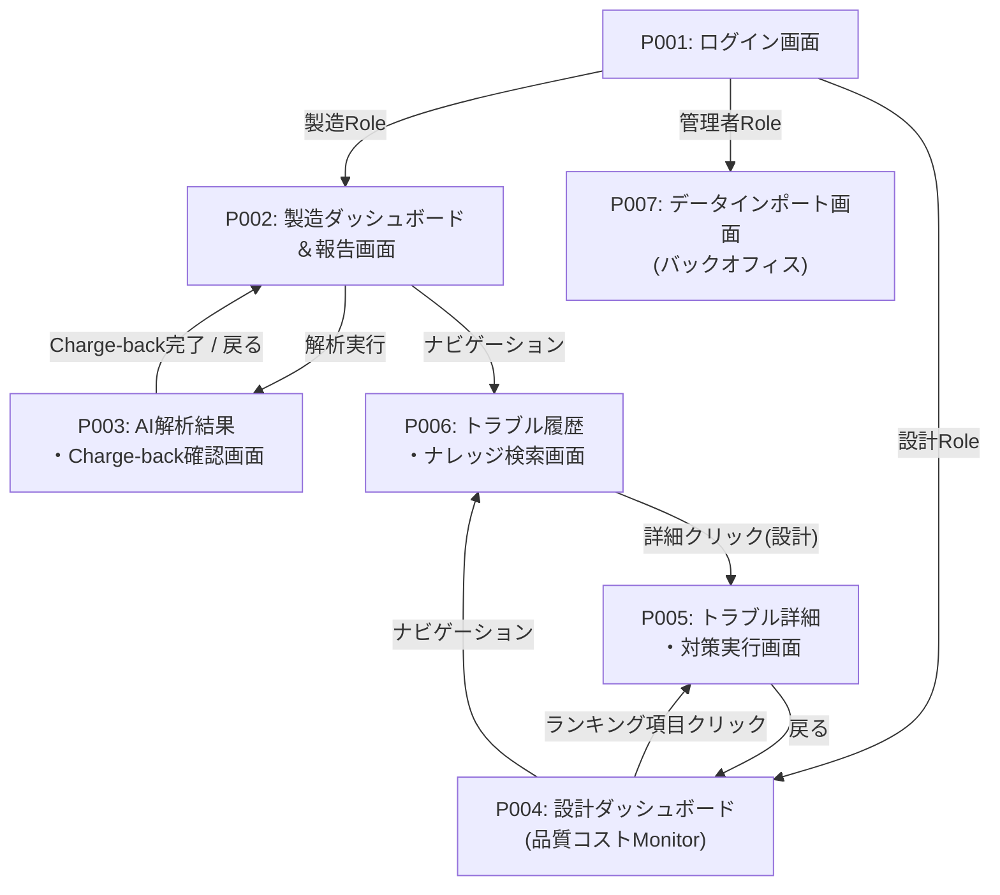

# 画面フロー・遷移図

## 概要
| 項目 | 内容 |
|------|------|
| プロジェクト | トラブルナレッジベース（品質コスト管理） |
| Sprint | 2 |
| 作成日 | 2026-02-18 |

## ページリスト（確定版）

| ページID | ページ名 | 対象ユーザー | 説明 |
|---------|---------|------------|------|
| P001 | ログイン画面 | 共通 | メール認証とRole判定による画面振り分け |
| P002 | 製造ダッシュボード＆報告画面 | 製造部門 | トラブル起票・RAGサジェスト・Charge-back累計表示 |
| P003 | AI解析結果・Charge-back確認画面 | 製造部門 | AI構造化データ確認・損失額プレビュー・Charge-back実行 |
| P004 | 設計ダッシュボード | 設計部門 | 設計起因損失総額・ワーストランキング（パレート分析） |
| P005 | トラブル詳細・対策実行画面 | 設計部門 | AI分析詳細・ROIシミュレーション・対策ステータス更新・現場通知 |
| P006 | トラブル履歴・ナレッジ検索画面 | 共通 | 過去データの検索・ナレッジ閲覧 |
| P007 | データインポート画面 | 管理者 | CSV一括取込・AI構造化バッチ処理 |

## ページ関係表

| ページ名 | 説明 | 遷移元 | 遷移先 | 遷移トリガー |
|--------|------|--------|--------|------------|
| P001: ログイン画面 | 認証とRole振り分け | - | P002（製造）, P004（設計）, P007（管理者） | ログインボタン → Role判定 |
| P002: 製造ダッシュボード＆報告画面 | トラブル起票とRAGサジェスト | P001, P003 | P003, P006 | 解析実行ボタン → P003 / ナビゲーション → P006 |
| P003: AI解析結果・Charge-back確認画面 | AI判定結果とCharge-back | P002 | P002 | Charge-back実行 → P002 / 戻るボタン → P002 |
| P004: 設計ダッシュボード | 損失総額とパレート分析 | P001, P005 | P005, P006 | ランキング項目クリック → P005 / ナビゲーション → P006 |
| P005: トラブル詳細・対策実行画面 | ROI分析と対策ステータス更新 | P004, P006 | P004 | 戻るボタン → P004 |
| P006: トラブル履歴・ナレッジ検索画面 | 過去データ検索とナレッジ閲覧 | P002, P004 | P005（設計の場合） | テーブル行クリック → 詳細表示 |
| P007: データインポート画面 | CSV取込とAIバッチ処理 | P001 | P001 | インポート完了 → ログアウト |

## ページ遷移図

## 補足

- 各Pageの詳細仕様は `specifications/{page-name}.md` を参照
- P002 ↔ P003 は製造部門のメインフロー（起票→AI解析→Charge-back→ダッシュボードに戻る）
- P004 → P005 は設計部門のメインフロー（ダッシュボード→詳細分析→対策実行→ダッシュボードに戻る）
- P006 は両部門からアクセス可能な共通ナレッジベース
- P007 は管理者専用のバックオフィス機能
- モーダルやポップアップ（P005のトラブル個別詳細、P006のナレッジ詳細）は遷移図では簡略化
